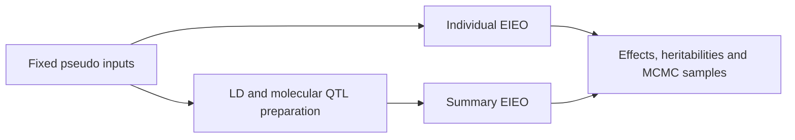

# BayesOmics

[](LICENSE.md)

BayesOmics is a C++ tool for joint analysis of complex-trait GWAS and molecular
QTL data. Its public integrative model, **SBayesCO-EIEO**, supports both
individual-level and summary-level analysis to estimate genetic effects and
heritability components.

[Manual](https://shouyeliu.github.io/softwares/content-softwares.html) ·
[Pseudo example](samples/pseudo/lbs582-585/README.md) ·
[Papers](#papers) ·
[Report an issue](https://github.com/ShouyeLiu/BayesOmics/issues)

## Papers

Please cite the paper corresponding to the method used in your analysis.

### 2026 — Joint modelling of molecular QTL and GWAS effects

**[Joint Bayesian modelling of molecular QTL and GWAS effects improves polygenic prediction for complex traits](https://www.medrxiv.org/content/10.64898/2026.03.10.26347908v1)**

Shouye Liu, Yang Wu, Zhili Zheng, Hao Cheng, Michael E. Goddard, Jian Yang,
Peter M. Visscher and Jian Zeng. **medRxiv preprint**, 10 March 2026.
[DOI: 10.64898/2026.03.10.26347908](https://doi.org/10.64898/2026.03.10.26347908).

**Method in this release:** SBayesCO-EIEO, with individual-level and summary-level
analysis paths. The paper introduces joint modelling of GWAS and molecular QTL
effects for polygenic prediction.

## Analysis paths

| Path | Model options | Inputs |
| --- | --- | --- |
| Individual-level SBayesCO-EIEO | `--bayes CO --mcmc-type EIEO` | PLINK genotype, GWAS phenotype, molecular phenotypes and gene–SNP map |
| Summary-level SBayesCO-EIEO | `--sbayes CO --mcmc-type EIEO` | GWAS and molecular QTL summary statistics with matching LD references |

EIEO is the default integrative sampling mode. Data-management commands prepare
block LD, molecular LD and molecular summary formats. The existing GWAS-only
C/R utilities remain available.



## Installation

Required build dependencies are a C++17 compiler, CMake, Boost
(program_options, iostreams, system and filesystem), Eigen3, Armadillo, OpenMP,
BLAS/LAPACK and HDF5 with C/C++ development headers and libraries. CMake checks
for these dependencies during configuration.

```sh
git clone https://github.com/ShouyeLiu/BayesOmics.git
cd BayesOmics
cmake -S . -B build -DCMAKE_BUILD_TYPE=Release
cmake --build build --parallel 2
ctest --test-dir build --output-on-failure
./build/BayesOmics64 --help
```

These commands produce `build/BayesOmics64`. The included CTest checks cover
command-line help and rejection of unsupported models and sampling modes; they
do not replace numerical model validation. Use `-DCMAKE_BUILD_TYPE=Debug` when
configuring a debug build. Detailed platform instructions belong in the manual.

## Run the prepared pseudo example

From the repository root after building:

```sh
sh samples/pseudo/lbs582-585/run-pseudo-1kg-chr22-cau-lbs582-585-n10000-prepare-inputs.sh
sh samples/pseudo/lbs582-585/run-pseudo-1kg-chr22-cau-lbs582-585-n10000-SBayesCO-EIEO-individual.sh
sh samples/pseudo/lbs582-585/run-pseudo-1kg-chr22-cau-lbs582-585-n10000-SBayesCO-EIEO-summary.sh
```

The saved example contains **10,000 pseudo individuals, 5,092 SNPs and 12
molecular phenotypes** in chromosome 22 LD blocks **582–585**, with 493 model
molecular SNP–gene pairs. It reuses existing simulated inputs; running these
scripts does not generate another simulation.

Both model scripts use **3,000 iterations, 2,000 burn-in, thinning 1 and seed
20260914**, and request complete text MCMC output. They use one thread to match
the reference settings. Inputs, options, output prefixes and scale conventions
are described once in the [example guide](samples/pseudo/lbs582-585/README.md).

## Files and reproducibility

- `src/` and `include/`: C++ implementation and interfaces.
- `tests/`: maintained command-line checks.
- `samples/pseudo/lbs582-585/`: prepared pseudo inputs, truth, checksum manifest
  and runnable scripts.

Keep SNP identifiers, allele coding, sample order and genotype scales aligned
between phenotypes, summary statistics and LD. The example includes these
mappings explicitly. Generated LD, logs, build products and MCMC output are
excluded from Git.

The separate [SBayesOmics R package](https://github.com/ShouyeLiu/SBayesOmics)
provides simulation functionality. It is not needed to run this prepared example.

## Documentation and support

Use the [BayesOmics manual](https://shouyeliu.github.io/softwares/content-softwares.html)
for data management, integrative analysis and file-format explanations. See
[Papers](#papers) for the method references.

For questions or reproducible bug reports, please
[open an issue](https://github.com/ShouyeLiu/BayesOmics/issues), including the
software revision, command, build environment and a minimal public example.
Contact: Shouye Liu, shouye.liu@uq.edu.au.

BayesOmics is distributed under [GPL version 3](LICENSE.md).
